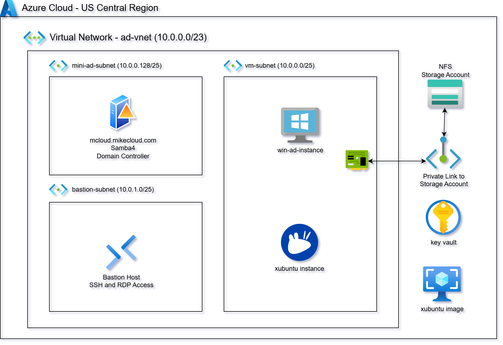
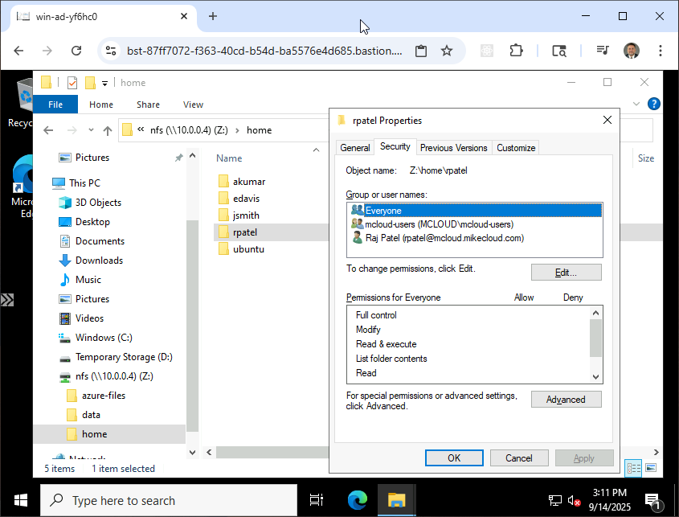
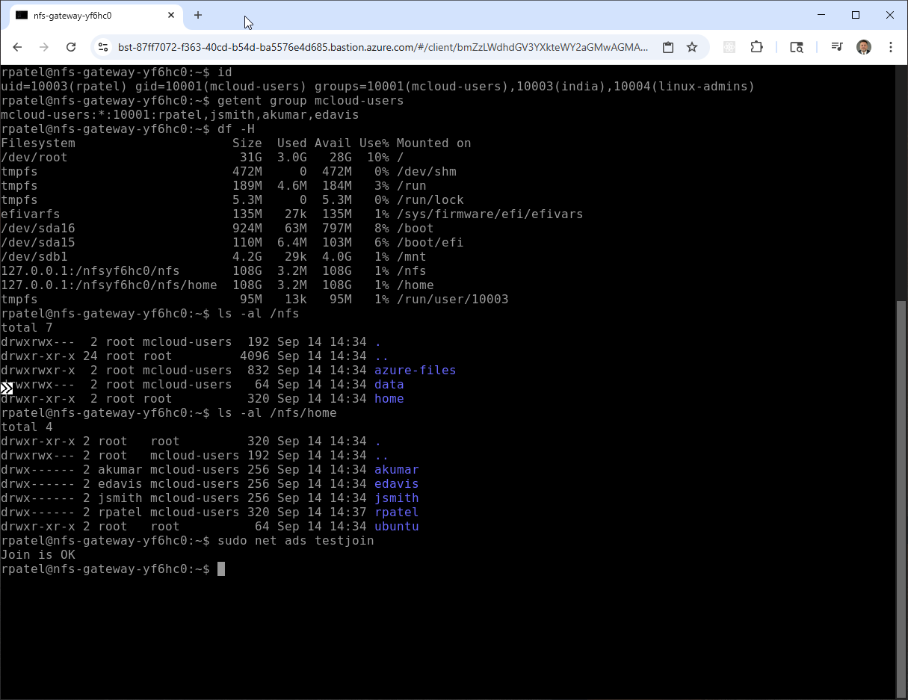

# Azure Xubuntu XRDP Cloud Development Environment

This project provides a **complete cloud-based Linux desktop development environment**
powered by **Xubuntu + XRDP**, **Mini-Active Directory**, and **Azure Files (NFS)** on
the Microsoft Azure platform.

It is designed as a **universal dev workstation** that contains the full superset of
tools, dependencies, and configurations used across all build projects on my channel.


Instead of manually configuring a workstation for each tutorial, demo, or cloud
project, this solution automatically provisions:

1. **A Custom Xubuntu XRDP Azure Image (Packer)**
   - Preloaded with Chrome, Firefox (deb), VS Code, Docker, KRDC, Postman
   - Includes all development tooling used across channel projects:
     **Packer, Terraform, Docker CLI, Azure CLI, AWS CLI v2, Google Cloud CLI**
   - Snap-free, clean, lightweight Xfce desktop
   - XRDP fully configured with all fixes, enhancements, and defaults
   - Desktop/panel icons, terminal emulator defaults, and `/etc/skel` customizations

2. **A Mini Active Directory Domain (Terraform)**
   - Samba-based AD Domain Controller running on Azure
   - Domain users generated from a template with friendly passwords
   - Central authentication for Linux and Windows clients

3. **Domain-Joined Xubuntu XRDP VM (Terraform)**
   - Deploys the Xubuntu XRDP instance using the Packer-built Azure Managed Image
   - Automatically joins the Mini-AD domain during boot
   - Ensures consistent user profiles and default settings through `/etc/skel`

4. **Azure Files (Premium NFS) for Persistent Home Directories**
   - Linux instances mount Azure Files via NFS 4.1
   - Provides centralized, persistent, scalable home directories
   - Ideal for multi-VM desktop pools or Azure-based demo environments

The result is a **disposable, reproducible, cloud-hosted Linux workstation** that
can be used for **any build, automation, or cloud project**
featured on the channel.




## Prerequisites

* [An Azure Account](https://portal.azure.com/)
* [Install AZ CLI](https://learn.microsoft.com/en-us/cli/azure/install-azure-cli) 
* [Install Terraform](https://developer.hashicorp.com/terraform/install)
* [Install Packer](https://developer.hashicorp.com/packer/install)

If this is your first time watching our content, we recommend starting with this video: [Azure + Terraform: Easy Setup](https://www.youtube.com/watch?v=j4aRjgH5H8Q). It provides a step-by-step guide to properly configure Terraform, Packer, and the AZ CLI.


## Download this Repository

```bash
git clone https://github.com/mamonaco1973/azure-xubuntu-xrdp.git
cd azure-xubuntu-xrdp
```


## Build the Code

Run [check_env](check_env.sh) to validate your environment, then run [apply](apply.sh) to provision the infrastructure.

```bash
azureuser@devel~/azure-xubuntu-xrdp$ ./apply.sh
NOTE: Validating that required commands are found in your PATH.
NOTE: az is found in the current PATH.
NOTE: terraform is found in the current PATH.
NOTE: jq is found in the current PATH.
NOTE: packer is found in the current PATH.
NOTE: All required commands are available.
NOTE: Validating that required environment variables are set.
NOTE: ARM_CLIENT_ID is set.
NOTE: ARM_CLIENT_SECRET is set.
NOTE: ARM_SUBSCRIPTION_ID is set.
NOTE: ARM_TENANT_ID is set.
NOTE: All required environment variables are set.
NOTE: Logging in to Azure using Service Principal...
NOTE: Successfully logged into Azure.
Initializing the backend...
Initializing modules...
Initializing provider plugins...
- Reusing previous version of hashicorp/random from the dependency lock file
- Reusing previous version of hashicorp/time from the dependency lock file
- Reusing previous version of hashicorp/azurerm from the dependency lock file
- Using previously-installed hashicorp/random v3.7.2
- Using previously-installed hashicorp/time v0.13.1
```

### Build Results

When the deployment completes, the following resources are created:

- **Networking:**  
  - A dedicated Azure Virtual Network with public and private subnets  
  - Public IPs and optionally Bastion for secure management access  
  - Route tables and NSGs configured to support AD, Azure Files (NFS),  
    and the Xubuntu XRDP VM  

- **Security & Identity:**  
  - Network Security Groups for the domain controller, Linux desktop VM,  
    Windows admin VM, and storage services  
  - Managed Identities and RBAC permissions allowing VMs to:  
    - Retrieve secrets from **Azure Key Vault**  
    - Mount Azure Files via NFS 4.1  
    - Perform domain join and bootstrapping without embedding credentials  
  - AD administrator credentials and autogenerated user passwords stored  
    securely in **Azure Key Vault**  

- **Mini Active Directory Server:**  
  - Ubuntu-based VM running Samba 4 as the Domain Controller and DNS server  
  - Configured Kerberos realm, DNS zone, and NetBIOS name  
  - Domain users generated from a template with friendly passwords stored  
    in Key Vault  

- **Azure Files (Premium NFS):**  
  - Premium FileStorage account with NFS 4.1 shares  
  - Private endpoints and NSGs allowing NFS traffic (TCP/2049) from XRDP VMs  
  - Serves as centralized home directory storage for Xubuntu desktop users  

- **Packer-Built Xubuntu XRDP Image:**  
  - Custom Azure Managed Image containing:  
    - Xubuntu (XFCE), XRDP, Chrome, Firefox (deb), VS Code  
    - Development tools: **Packer, Terraform, Docker CLI, Azure CLI,  
      AWS CLI v2, Google Cloud CLI**  
    - KRDC, Postman, and all channel-wide tooling  
  - `/etc/skel` configured for default desktop icons, terminal emulator,  
    wallpaper, and session defaults  
  - All XRDP fixes applied (session startup, untrusted launcher behavior,  
    consistent terminal defaults, etc.)  

- **Xubuntu XRDP Desktop VM:**  
  - Azure VM deployed from the custom Managed Image  
  - Automatically joins the Mini-AD domain during cloud-init  
  - Home directories mounted from Azure Files (NFS 4.1)  
  - Fully configured cloud development workstation ready for any project  
    on the channel  

- **Windows Admin VM (Optional):**  
  - Domain-joined Windows Server with RSAT, ADUC, and DNS tools  
  - Useful for validation, troubleshooting, and Windows-based demo scenarios


### Users and Groups

As part of this project, when the domain controller is provisioned, a set of sample **users** and **groups** are automatically created through Terraform-provisioned scripts running on the mini-ad server. These resources are intended for **testing and demonstration purposes**, showcasing how to automate user and group provisioning in a self-managed Active Directory environment.


#### Groups Created

| Group Name    | Group Category | Group Scope | gidNumber |
|---------------|----------------|-------------|-----------|
| mcloud-users  | Security       | Universal   | 10001     |
| india         | Security       | Universal   | 10002     |
| us            | Security       | Universal   | 10003     |
| linux-admins  | Security       | Universal   | 10004     |

#### Users Created and Group Memberships

| Username | Full Name   | uidNumber | gidNumber | Groups Joined                    |
|----------|-------------|-----------|-----------|-----------------------------------|
| jsmith   | John Smith  | 10001     | 10001     | mcloud-users, us, linux-admins    |
| edavis   | Emily Davis | 10002     | 10001     | mcloud-users, us                  |
| rpatel   | Raj Patel   | 10003     | 10001     | mcloud-users, india, linux-admins |
| akumar   | Amit Kumar  | 10004     | 10001     | mcloud-users, india               |

---

#### Understanding `uidNumber` and `gidNumber` for Linux Integration

The **`uidNumber`** (User ID) and **`gidNumber`** (Group ID) attributes are critical when integrating **Active Directory** with **Linux systems**, particularly in environments where **SSSD** ([System Security Services Daemon](https://sssd.io/)) or similar services are used for identity management. These attributes allow Linux hosts to recognize and map Active Directory users and groups into the **POSIX** (Portable Operating System Interface) user and group model.


### Creating a New Desktop User

Follow these steps to provision a new user in the Active Directory domain and validate their access to the Desktop.

1. **Connect to the Domain Controller**  
   - Log into the **`windows-ad-admin`** server via Remote Desktop (RDP).  
   - Use the `rpatel` or `jsmith` credentials that were provisioned during cluster deployment.  

2. **Launch Active Directory Users and Computers (ADUC)**  
   - From the Windows Start menu, open **“Active Directory Users and Computers.”**  
   - Enable **Advanced Features** under the **View** menu. This ensures you can access the extended attribute tabs (e.g., UID/GID mappings).  

3. **Navigate to the Users Organizational Unit (OU)**  
   - In the left-hand tree, expand the domain (e.g., `mcloud.mikecloud.com`).  
   - Select the **Users** OU where all cluster accounts are managed.  

4. **Create a New User Object**  
   - Right-click the Users OU and choose **New → User.**  
   - Provide the following:  
     - **Full Name:** Descriptive user name (e.g., “Mike Cloud”).  
     - **User Logon Name (User Principal Name / UPN):** e.g., `mcloud@mcloud.mikecloud.com`.  
     - **Initial Password:** Set an initial password.



5. **Assign a Unique UID Number**  
   - Open **PowerShell** on the AD server.  
   - Run the script located at:  
     ```powershell
     Z:\azure-xubuntu-xrdp\04-utils\getNextUID.bat
     ```  
   - This script returns the next available **`uidNumber`** to assign to the new account.  

6. **Configure Advanced Attributes**  
   - In the new user’s **Properties** dialog, open the **Attribute Editor** tab.  
   - Set the following values:  
     - `gidNumber` → **10001** (the shared GID for the `mcloud-users` group).  
     - `uid` → match the user’s AD login ID (e.g., `rpatel`).  
     - `uidNumber` → the unique numeric value returned from `getNextUID.ps1`.  

7. **Add Group Memberships**  
   - Go to the **Member Of** tab.  
   - Add the user to the following groups:  
     - **mcloud-users** → grants standard Desktop access.  
     - **us** (or other geographic/departmental group as applicable).  

8. **Validate User on Linux**  
   - Open an **AWS Systems Manager (SSM)** session to the **`xubuntu-instance`** instance.  
   - Run the following command to confirm the user’s identity mapping:  
     ```bash
     id mcloud
     ```  
   - Verify that the output shows the correct **UID**, **GID**, and group memberships (e.g., `mcloud-users`).  



9. **Validate Desktop Access**  
   - Open the a RDP session to the desktop environment
   - Log in with the new AD credentials.  


### Clean Up Infrastructure  

When you are finished testing, you can remove all provisioned resources with:  

```bash
./destroy.sh
```

This will remove all Azure resources created by the project — including the resource group, virtual network, subnets, network security groups, public IPs, NICs, the Xubuntu VM, and any supporting infrastructure. Secrets stored in Azure Key Vault will also be deleted unless a retention policy prevents their removal.
